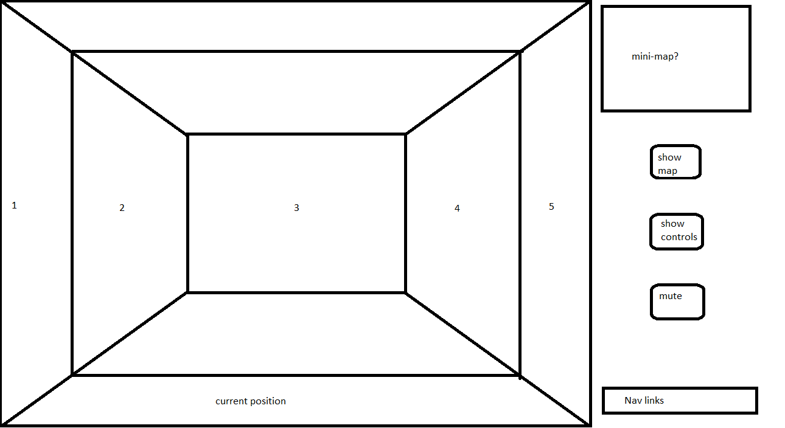
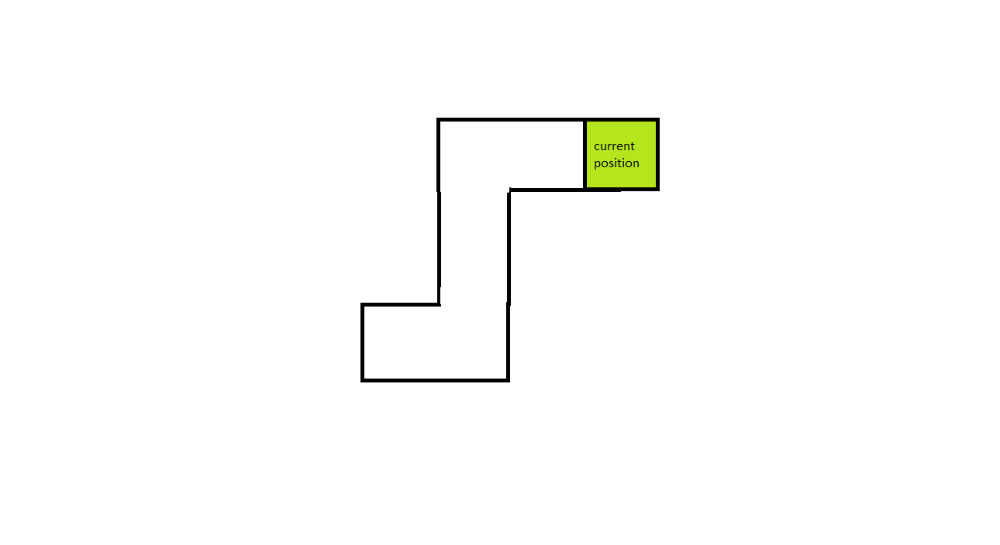

<!-- ### JS Project Proposal: First-Person Labyrinth Game -->
# Labyrinth

## Background

[Labyrinth](https://stevennotovitz.github.io/aA-JS-project-Labyrinth/) is a first-person perspective labyrinth puzzle game using HTML Canvas. The player must navigate through the dungeon by moving from tile to adjacent traversable tile using the arrow keys.\

Labyrinth uses JavaScript and HTML Canvas to draw the dungeon and handle user input, and CSS for styling the interface.\

Once a game is started and the player placed in the maze, the view of the player will be rendered using 2d shapes that evoke a first-person perspective. As the player moves or turns, the game dynamically toggles the fill styles of the Canvas shapes based on the state of the maze at the player's position.\

Though there is no 3d rendering in the game, Labyrinth aims to evoke a first-person perspective experience.

## Wireframes

-The Header includes game Logo, Title, and Nav links to Github and LinkedIn.\
-There are buttons to select a level, reset the game, and toggle the music.\
-The Heads-up display contains a minimap, compass, map screen toggle button, and user instructions.\
-The user will be able to use the Left, Right, and Up Arrow keys to turn and step forward, and either the clickable map button, or the "m" key to bring up the map.

## Functionality

In Labyrinth, users will be charged with navigating their way out of the labyrinth environment. The player is able to:\
-move from tile to traversable tile using the arrow keys\
-access a map screen that will be revealed as the player explores

### Move

The player uses the arrow keys to traverse the environment and the view updates appropriately. There is a refractory period of 0.5 seconds between successful moves. The game will render the view based on the world state, and will update the world state with each player move. The game ends when the player has found the way out.

### Map

The map screen starts out unexplored, and is revealed gradually, as the player wanders the labyrinth. The map can also keep track of the player's current and previously visited positions. The map starts zoomed in, and only expands to the level's full size once the player has explored far enough from the lavel's starting position. Additionally, a minimap and compass help the player stay oriented.

### Bonus Features:

-create multiple levels\
-randomly select one of several starting positions for the player\
-bonus bonus feature: random generation of levels\
-music and sounds, including monster sounds (see below)\
-monster wandering the maze - lose condition (see below)

## Technologies, Libraries, APIs

This project is to be implemented with the following technologies:\
-The [Canvas API](https://canvas.instructure.com/doc/api/) to render the first-person view of the labyrinth\
-[npm](https://docs.npmjs.com/) to manage project dependencies

## Implementation Timeline

**Friday Afternoon & Weekend:** Setup project, including getting webpack up and running. Get canvas to show up on the screen, and spend time getting comfortable with the Canvas API. Create Game and WorldState classes. Get a first-person view rendered to the canvas reflecting an initial state (starting position). Implement the functions that will dynamically change the fill styles of the “walls” based on the world state, which will contain information about whether each wall is a WALL or a SPACE. Make sure everything can render correctly on the Canvas.

**Monday:** Dedicate this day toward implementing the underlying logic of the maze, including generating a very simple testing level. Implement all the logic governing the labyrinth itself.

**Tuesday:** If I didn’t get to do this already, get the trapezoids correctly rendered to the canvas. Make sure they re-render correctly when I advance a position. Then, focus on the map screen: visuals, as well as logic - it should reveal itself as the player explores.

**Wednesday:** Implement user controls - movement and map toggling - and focus on styling and map generation. If time, start on bonuses.

**Thursday Morning:** Deploy to GitHub pages.

## Future Implementations

There are many directions this dungeon escape game could eventually go. Some anticipated updates are:\
-let there be a monster wandering the labyrinth - play threatening sounds every once in a while, with volume proportional to how close the monster is\
-have more levels, with different visual syles and color palletes: hedge maze, pyramid tomb, etc.
-fix te mapButtonDiv erroneously having hover and active styles before the game starts\
-fix the styling to be completely dynamic based on window size\
-allow the map to be opened even after the end view has been rendered\
-refactor the code to be more sensible\

## Sources

-Favicon is a cropped image of a Greek silver coin from 400BC depicting the Labyrinth of Knossos.\
-Github and LinkedIn icons were provided by Font Awesome and only had colors changed.\
-Vecna Font by Pixel Sagas, from fontspace.com\
-Map 2d art from 0pengameart.org by yd\
-Menu music from the game Myst\
-Game music from the game Minecraft\
-End music from Claude Debussy\